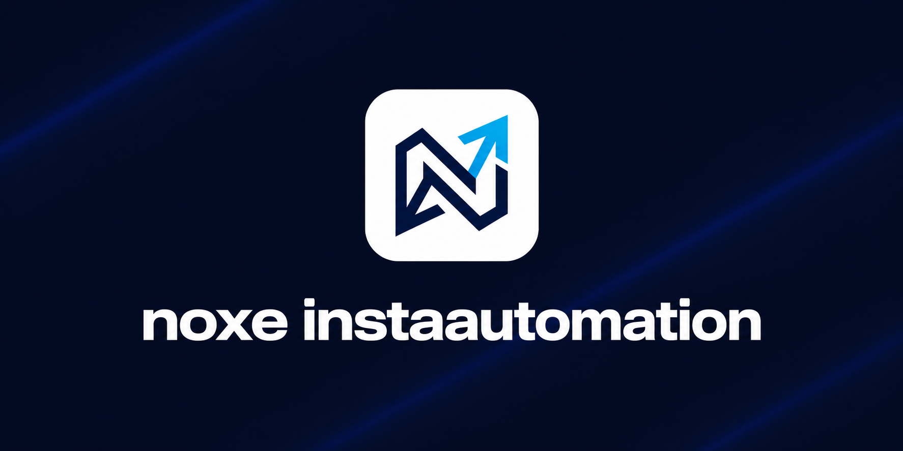

<p align="center">
  
</p>

# noxe-insta-automation

[](LICENSE)
[](https://github.com/VitorSaviolli/Noxe_InstaAutomation/actions/workflows/ci.yml)

Quando alguém comenta uma palavra combinada em um Reel da sua conta profissional do Instagram, este projeto manda o link no Direct dessa pessoa e só depois responde publicamente ao comentário.

Ele roda na Cloudflare, acorda só quando chega um comentário e cabe nos planos gratuitos da Cloudflare e da Meta — não existe servidor para manter nem cobrança envolvida.

Você não precisa saber programar para usar: o passo a passo é clicar no painel da Cloudflare, no painel da Meta e copiar alguns comandos.

> **Exemplo concreto:** você publica um Reel e escreve na legenda *"comente **eu quero** que eu te mando o link"*. Alguém comenta `eu quero`. Em segundos essa pessoa recebe o link no Direct dela, e no comentário aparece a sua resposta pública: *"Enviei as informações no seu Direct."*

---

## 👉 Não é programador? Comece por aqui

> ### **[Leia o readmeiniciante.md](readmeiniciante.md)**
>
> **Se você não sabe programar, não comece por este README.** Ele pressupõe que você já sabe abrir um terminal e já tem o Node.js e o git instalados.
>
> O **[readmeiniciante.md](readmeiniciante.md)** é o passo a passo do zero absoluto, **mesmo**: o que é um terminal e como abrir, como instalar o Node.js e o git clicando botão por botão (Windows e Mac), como criar as quatro contas necessárias, como baixar o projeto, como editar um arquivo sem estragar, e o que fazer quando aparecer erro.
>
> São 10 etapas, cerca de 1h30 na primeira vez, e nenhuma delas pede cartão de crédito.

---

## Aviso legal e uso responsável

> **Leia antes de instalar.**
>
> - Este projeto usa a **API oficial da Meta**. Ele não faz login fingindo ser você, não automatiza o aplicativo e não usa nenhum truque para contornar a plataforma.
> - **Quem roda a própria instância é o responsável** por cumprir os [Termos da Plataforma Meta](https://developers.facebook.com/terms/) e os Termos de Uso do Instagram. A responsabilidade é de quem publica o Worker e conecta a conta — não do autor deste código.
> - **Uso abusivo pode custar sua conta.** Disparo em massa, spam, mensagens enganosas, promessa de conteúdo que você não entrega ou automação em conta de terceiros sem autorização podem levar a restrição de recursos, bloqueio do app ou banimento da conta no Instagram.
> - O software é fornecido **"como está" (as is), sem garantia de qualquer tipo**, conforme a [licença MIT](LICENSE). Se a Meta mudar uma regra amanhã e algo parar de funcionar, não há garantia de correção nem de suporte.
> - **Não há nenhuma afiliação com a Meta**, com o Instagram ou com a Cloudflare. Este é um projeto independente e não oficial.
>
> Resumindo em uma frase: use na sua própria conta, entregue de verdade o que você prometeu na legenda, e você não terá problema.

---

## Índice

[**Não é programador?**](readmeiniciante.md) — vá para o [readmeiniciante.md](readmeiniciante.md), o passo a passo do zero absoluto.

[Aviso legal e uso responsável](#aviso-legal-e-uso-responsável) — logo acima, leia primeiro.

1. [O que este projeto NÃO faz](#1-o-que-este-projeto-não-faz)
2. [Requisitos](#2-requisitos)
3. [Comece por aqui](#3-comece-por-aqui)
4. [Substitua estes valores](#4-substitua-estes-valores)
5. [Segredos e Git: o que nunca pode ir para o GitHub](#5-segredos-e-git-o-que-nunca-pode-ir-para-o-github)
6. [Como funciona (passo a passo)](#6-como-funciona-passo-a-passo)
7. [Árvore de arquivos comentada](#7-árvore-de-arquivos-comentada)
8. [Como configurar o gatilho](#8-como-configurar-o-gatilho)
9. [Automações por Reel (mediaAutomations)](#9-automações-por-reel-mediaautomations)
10. [Comandos disponíveis](#10-comandos-disponíveis)
11. [Garantia de funcionamento gratuito](#11-garantia-de-funcionamento-gratuito)
12. [Política de versão da Graph API](#12-política-de-versão-da-graph-api)
13. [Segurança e privacidade](#13-segurança-e-privacidade)
14. [Documentos relacionados](#14-documentos-relacionados)
15. [Licença](#15-licença)

---

## 1. O que este projeto NÃO faz

Melhor descobrir os limites agora do que depois de gastar duas horas na instalação.

- **Não burla nem aumenta os limites da Meta.** A Meta permite **um Direct por comentário**, dentro de uma **janela de 7 dias** a partir do comentário, e **750 chamadas por hora** por conta. Esses tetos são da plataforma; o projeto os respeita e não tem como contorná-los.
- **Não gera conteúdo.** Ele não escreve legenda, não cria Reel, não responde de forma "inteligente". Os textos são os que você escrever no arquivo de configuração — sempre os mesmos.
- **Não gerencia várias contas ao mesmo tempo.** Uma instalação atende **uma** conta do Instagram. Para uma segunda conta, você publica um segundo Worker, com banco e app próprios.
- **Não tem contas de usuário.** O projeto **tem** painel web, mas ele é de uma pessoa só: você entra com a sua passkey, e não existe cadastro, convite de equipe nem níveis de permissão. Para outra pessoa administrar, ela cadastra uma passkey no **mesmo** painel — não há como dar acesso parcial a ninguém.
- **Não funciona com conta pessoal.** A conta do Instagram precisa ser **profissional** (Comercial ou Criador de conteúdo). Conta pessoal não tem acesso à API.
- **Não manda Direct para quem nunca comentou.** A Meta identifica o destinatário pelo **ID do comentário**. Sem comentário, não existe permissão para enviar mensagem — não dá para importar lista, nem disparar para seguidores.
- **Não substitui o App Review quando você ultrapassar o uso básico.** Automatizar **a sua própria conta** funciona com Standard Access, sem revisão. Atender contas de terceiros ou clientes exige Advanced Access, que passa por App Review e verificação de negócio na Meta.
- **Não responde comentário antigo.** Passados 7 dias da criação do comentário, a Meta não aceita mais o Direct daquele comentário. Não há como recuperar.
- **Não é um serviço hospedado.** Não existe "criar conta e usar". Você publica a sua própria instância, nas suas contas da Cloudflare e da Meta, e ela é só sua.

---

## 2. Requisitos

Tudo o que você precisa ter antes de começar. **Todos os serviços da lista têm plano gratuito suficiente para este projeto** — nada aqui exige cartão de crédito.

### Contas (crie antes de começar, leva uns 15 minutos)

| O que | Para quê | Observação |
|---|---|---|
| **Conta profissional no Instagram** | É a conta que vai responder aos comentários. | Precisa ser do tipo **Comercial** ou **Criador de conteúdo**. Trocar é grátis e leva 1 minuto: Instagram → Configurações → Tipo de conta e ferramentas. **Conta pessoal não funciona.** |
| **Conta no Facebook** | A Meta exige uma conta do Facebook para você entrar no Meta for Developers e criar o app. | Serve uma conta que você já tenha. Ela não precisa publicar nada. |
| **Conta na Cloudflare** | É onde o código vai rodar (Workers) e onde fica o banco de dados (D1). | Plano **Free**. Não cadastre cartão — veja a [seção 11](#11-garantia-de-funcionamento-gratuito). |
| **Conta no Meta for Developers** | É onde você cria o "app" que dá acesso à API do Instagram. | Grátis. Acesso em developers.facebook.com, usando a conta do Facebook acima. |

### Programas no seu computador

| O que | Versão | Como conferir |
|---|---|---|
| **Node.js** | 20 ou superior | `node --version` no terminal. Se não responder, instale em https://nodejs.org (baixe a versão LTS). |
| **npm** | vem junto com o Node | `npm --version` |
| **git** | qualquer versão atual | `git --version`. Se não responder, instale em https://git-scm.com |

> O `wrangler` (o programa de linha de comando da Cloudflare) **não** precisa ser instalado à parte. Ele já vem como dependência do projeto e é chamado com `npx`.

### O que você NÃO precisa

- Não precisa de servidor, VPS, hospedagem ou domínio próprio.
- Não precisa de cartão de crédito.
- Não precisa saber programar. Precisa saber copiar, colar e seguir instrução na ordem.

---

## 3. Comece por aqui

### Passo 1 — Obter o código

Abra o terminal (no Windows: PowerShell; no Mac ou Linux: Terminal), vá até a pasta onde você guarda seus projetos e rode os três comandos abaixo, um de cada vez.

O endereço abaixo é o do repositório oficial. Se você estiver baixando de um fork, troque pelo endereço que aparece no botão verde **Code** daquela página:

```bash
git clone https://github.com/VitorSaviolli/Noxe_InstaAutomation.git
cd Noxe_InstaAutomation
npm install
```

O que cada um faz:

- `git clone` baixa o projeto para uma pasta nova chamada `Noxe_InstaAutomation`.
- `cd` entra nessa pasta. **Todos os comandos deste projeto são rodados de dentro dela.**
- `npm install` baixa as dependências (inclusive o `wrangler`). Demora um pouco na primeira vez e é normal aparecerem várias linhas de texto.

> **Não baixe o projeto como ZIP pelo botão verde do GitHub.** Funciona, mas você perde o histórico e, principalmente, perde a proteção do `git` na hora de publicar as suas alterações. Veja a [seção 5](#5-segredos-e-git-o-que-nunca-pode-ir-para-o-github).

### Passo 2 — O atalho: um comando que conduz tudo

```bash
npm run configurar
```

Esse comando abre um assistente no terminal que faz as perguntas na ordem certa e cuida da parte chata para você:

- gera os valores aleatórios dos segredos (senhas internas do projeto);
- mostra o comando exato para cadastrar cada um na Cloudflare;
- monta a URL de autorização do Instagram já preenchida;
- abre o navegador na hora de conectar a conta.

Ele **não substitui** os dois guias abaixo — ele acompanha você enquanto você os segue. Se em algum momento você se perder, volte para o guia correspondente.

### Passo 3 — Primeiro a Cloudflare, depois a Meta

Faça nesta ordem. Não inverta.

**1º — [SETUP_CLOUDFLARE.md](SETUP_CLOUDFLARE.md)**
Criar o banco de dados D1, aplicar as migrações, cadastrar os 4 segredos, publicar o Worker e **descobrir qual é a sua URL**.

**2º — [SETUP_META.md](SETUP_META.md)**
Criar o app no Meta for Developers, cadastrar a sua URL como endereço do webhook, pedir as permissões e conectar a sua conta do Instagram.

**Por que essa ordem?** Porque a sua URL só passa a existir depois do primeiro deploy. Quando você publica o Worker, a Cloudflare devolve um endereço no formato `https://SEU-WORKER.SEU-SUBDOMINIO.workers.dev`. A Meta precisa desse endereço para saber onde avisar quando alguém comentar — e ela testa o endereço na hora do cadastro. Se você começar pela Meta, vai travar no primeiro campo do formulário, sem ter o que digitar.

### Passo 4 — Personalizar

Depois que os dois guias estiverem concluídos, ajuste o que é seu: o link que será entregue, a palavra-gatilho e os textos. Está tudo reunido na [seção 4](#4-substitua-estes-valores).

### Passo 5 — Testar de verdade

Comente a palavra-gatilho em um Reel seu e veja se o Direct chega. É o teste mais confiável que existe. Para acompanhar ao vivo o que está acontecendo:

```bash
npm run tail
```

---

## 4. Substitua estes valores

O projeto vem com marcadores no lugar dos dados pessoais. Enquanto eles não forem trocados, a automação não funciona de verdade. Esta é a lista completa — não há nada escondido em outro lugar.

| O que trocar | Em qual arquivo | O que colocar no lugar |
|---|---|---|
| `database_id` | `wrangler.jsonc` | O identificador do **seu** banco D1. Vem como `COLE_AQUI_O_ID_DO_SEU_BANCO_D1`. O comando `npx wrangler d1 create noxe-insta-automation` cria o banco e devolve esse valor na tela. Passo a passo em [SETUP_CLOUDFLARE.md](SETUP_CLOUDFLARE.md). |
| `META_APP_ID` | `wrangler.jsonc`, bloco `vars` | O **ID do app do Instagram** que você criou no Meta for Developers. Vem como `COLE_AQUI_O_ID_DO_SEU_APP_META`. Cuidado: não é o ID do app do Facebook — veja o aviso logo abaixo. |
| `destinationUrl` | `src/config.ts` | O link que será entregue no Direct. Vem como `[COLOQUE_O_SEU_LINK_AQUI]` — **mas se você clonou o repositório de alguém que já publicou a própria configuração, aqui vai estar o link dessa pessoa.** Confira sempre. |
| `triggerKeywords` e os textos | `src/config.ts` | A palavra que dispara a automação, o texto do Direct e o texto da resposta pública. Detalhes na [seção 8](#8-como-configurar-o-gatilho). |
| `CONTATO_EMAIL` e `NOME_RESPONSAVEL` | `src/routes/legal.ts` | O e-mail real de contato e o nome de quem responde pelo tratamento dos dados. Vêm como `[SEU_EMAIL_DE_CONTATO]` e `[NOME_DO_RESPONSAVEL]`. |
| Os 4 segredos | **nenhum arquivo** | Nunca vão para dentro do projeto. São cadastrados um a um com `npx wrangler secret put NOME`. Veja a [seção 5](#5-segredos-e-git-o-que-nunca-pode-ir-para-o-github). |

### O link de destino (`destinationUrl`)

É o valor que substitui o `{link}` no texto da mensagem privada. Sem trocá-lo, a automação não tem o que entregar.

```ts
// como vem de fábrica
destinationUrl: '[COLOQUE_O_SEU_LINK_AQUI]',

// como deve ficar
destinationUrl: 'https://seusite.com.br/a-pagina-que-voce-quer',
```

O projeto reconhece o marcador de fábrica: qualquer valor vazio ou começando com `[` é tratado como "ainda não configurado".

> ⚠️ **Essa trava só protege quem ainda está com o marcador.** Se o repositório que você baixou já vier com um link real preenchido (o link do dono da instalação original), a automação vai funcionar — entregando o link **dele**. Abra o `src/config.ts` e confirme que o `destinationUrl` é o seu antes do primeiro deploy.

### O que você configura fora do código (no painel da Meta)

Nem tudo mora em arquivo. Estes quatro itens são preenchidos **no painel do Meta for Developers** e não têm equivalente no repositório — quem instala o projeto precisa fazer isso à mão. O passo a passo com as telas está no [SETUP_META.md](SETUP_META.md).

| Item | Onde no painel | O que colocar |
|---|---|---|
| **Ícone do app** (a "foto") | Configurações → Básico | Imagem quadrada **1024 × 1024 px**, PNG, fundo sólido, com a **sua** marca. Não pode usar logo do Instagram/Meta. É o ícone que aparece na tela de "Permitir" que a pessoa vê. Detalhes na [etapa 15.3 do SETUP_META.md](SETUP_META.md). |
| **URI de redirecionamento OAuth** | Casos de uso → Instagram → Personalizar (*Set up Instagram business login*) | `https://SEU-WORKER.SEU-SUBDOMINIO.workers.dev/oauth/callback` — um campo só, sem barra no final. |
| **URL da Política de Privacidade** | Configurações → Básico | `https://SEU-WORKER.SEU-SUBDOMINIO.workers.dev/privacy-policy` |
| **Instruções de exclusão de dados** | Configurações → Básico | `https://SEU-WORKER.SEU-SUBDOMINIO.workers.dev/data-deletion` |

> As duas últimas só funcionam de verdade depois que você preencher os dados de contato logo abaixo — senão as páginas abrem dizendo que o contato não foi informado.

### Os dados de contato (`src/routes/legal.ts`)

As páginas `/privacy-policy` e `/data-deletion` são públicas, e a Meta pede as URLs delas no cadastro do app. Elas precisam trazer informação verdadeira e uma forma real de contato:

- `CONTATO_EMAIL` — o e-mail para onde as pessoas escrevem para pedir exclusão de dados ou tirar dúvidas.
- `NOME_RESPONSAVEL` — o nome de quem responde por esse tratamento de dados (você, ou sua empresa).

### Confirme o par ID + segredo do app

Este é o ponto que mais gera confusão no painel da Meta, e vale a pena checar com calma.

No fluxo **Instagram Login** (que é o que este projeto usa), os valores que valem são o **"ID do app do Instagram"** e a **"Chave secreta do app do Instagram"**, que ficam na tela **Casos de uso > Personalizar**.

Eles **não são necessariamente os mesmos** que aparecem em **Configurações > Básico** (que são o ID e o segredo do app do Facebook). Muita gente copia os de *Configurações > Básico*, e aí a validação da assinatura do webhook falha sem explicação clara.

O que você precisa fazer: abrir **Casos de uso > Personalizar**, olhar o ID e a chave secreta do app do **Instagram**, e confirmar que são exatamente os valores configurados como:

- `META_APP_ID` — em `wrangler.jsonc`, no bloco `vars`;
- `META_APP_SECRET` — cadastrado como segredo (`npx wrangler secret put META_APP_SECRET`).

Se forem diferentes, corrija para os valores do Instagram. O passo a passo com as telas está em [SETUP_META.md](SETUP_META.md).

---

## 5. Segredos e Git: o que nunca pode ir para o GitHub

Se você nunca usou git, leia esta seção inteira. Ela evita o único erro deste projeto que é impossível de desfazer.

### O que são os segredos

Cinco valores funcionam como senha do projeto. Quem tiver eles em mãos consegue disparar Directs em seu nome ou ler o token da sua conta:

| Segredo | Para que serve |
|---|---|
| `META_APP_SECRET` | Valida a assinatura do webhook e a troca do código OAuth. Vem do painel da Meta. |
| `META_WEBHOOK_VERIFY_TOKEN` | Senha que você inventa e repete no painel da Meta, usada no aperto de mão do webhook. |
| `TOKEN_ENCRYPTION_KEY` | Chave que cifra o access token antes de ele ser gravado no banco. |
| `SETUP_ADMIN_TOKEN` | Protege as rotas `/setup/*` para que só você consiga iniciar o login. |
| `PANEL_SESSION_KEY` | Raiz das subchaves do painel administrativo. Sem ela o painel responde 503 e não existe. |

Em produção eles vivem na Cloudflare, cadastrados com `npx wrangler secret put NOME`. Para rodar na sua máquina, eles ficam em dois arquivos que existem **só no seu computador**:

- **`.dev.vars`** — os segredos usados pelo `npm run dev`.
- **`.env`** — variáveis auxiliares.

**Nenhum dos dois pode ir para o GitHub. Nunca.**

### A proteção que já existe

O arquivo `.gitignore` do projeto já bloqueia `.env` e `.dev.vars` (e as variações `.env.*` e `.dev.vars.*`). Só os modelos vazios, `.env.example` e `.dev.vars.example`, são versionados — e eles não contêm valor nenhum.

Ou seja: se você usar `git` normalmente, está protegido.

### Confira antes do primeiro commit

Antes de mandar qualquer coisa para o GitHub, rode:

```bash
git status
```

Esse comando lista os arquivos que estão prestes a ser enviados. **Nem `.env` nem `.dev.vars` podem aparecer nessa lista.** Se algum deles aparecer, pare e não continue — algo está errado no `.gitignore`.

O projeto tem um comando que faz essa verificação sozinho:

```bash
npm run verificar
```

Rode ele antes do primeiro `git push`. Se acusar problema, resolva antes de publicar.

### O erro que quebra tudo: publicar sem git

**Enviar o projeto por upload de ZIP ou arrastando a pasta na interface web do GitHub IGNORA COMPLETAMENTE o `.gitignore`.** A interface web só recebe os arquivos que você soltou nela — ela não lê regras de exclusão. O resultado é que o seu `.env` e o seu `.dev.vars`, com os segredos reais dentro, ficam publicados e visíveis para qualquer pessoa da internet.

E não adianta apagar depois: o GitHub guarda o histórico, e robôs varrem repositórios públicos atrás de segredos em questão de minutos.

**Sempre publique com `git`**, pelo terminal:

```bash
git add .
git status          # confira a lista antes de continuar
git commit -m "minha configuracao"
git push
```

> **Se um segredo vazar:** troque todos eles imediatamente. Gere valores novos, cadastre de novo com `npx wrangler secret put`, e troque a chave secreta do app no painel da Meta. O procedimento completo está em [SECURITY.md](SECURITY.md).

---

## 6. Como funciona (passo a passo)

### Ficha técnica

| Item | Valor |
|---|---|
| Nome do Worker | `noxe-insta-automation` |
| URL pública | `https://SEU-WORKER.SEU-SUBDOMINIO.workers.dev` (a sua só existe depois do primeiro deploy) |
| Banco D1 | `noxe-insta-automation` (você cria seguindo o [SETUP_CLOUDFLARE.md](SETUP_CLOUDFLARE.md)) |
| Configuração do Worker | `wrangler.jsonc` (este projeto **não** usa `wrangler.toml`) |
| Versão da Graph API | `v25.0` |

### O caminho completo, do comentário até o Direct

**1. A pessoa comenta no seu Reel.**
Ela escreve, por exemplo, `eu quero`.

**2. A Meta avisa o Worker.**
A Meta envia um `POST` para `https://SEU-WORKER.SEU-SUBDOMINIO.workers.dev/webhooks/instagram`. Isso é o "webhook": em vez de o projeto ficar perguntando "tem comentário novo?" o tempo todo, é a Meta que bate na porta quando algo acontece. Por isso o projeto não gasta nada ficando ligado — ele só acorda quando chega um comentário.

**3. O Worker confere se a mensagem é mesmo da Meta.**
Toda notificação chega com uma assinatura no cabeçalho `X-Hub-Signature-256`. O Worker recalcula essa assinatura usando o `META_APP_SECRET` e compara. Se não bater, a requisição é descartada. Isso impede que qualquer pessoa que descubra a URL consiga disparar Directs em seu nome.

**4. O Worker responde `200 OK` imediatamente.**
A Meta exige resposta rápida. Se o Worker demorasse para responder enquanto processa, a Meta consideraria falha e tentaria de novo, gerando comentários processados em duplicidade. Por isso o processamento pesado acontece depois da resposta, em segundo plano (`waitUntil`).

**5. O Worker decide se o comentário interessa.**
Ele normaliza o texto (minúsculas, acentos, pontuação — conforme sua configuração), compara com as palavras-gatilho e checa as regras: a automação está ligada? é um Reel? aquela mídia está liberada? o mesmo usuário já acionou nas últimas horas (cooldown)?

**6. Claim atômico no banco D1.**
Antes de qualquer chamada à Meta, o Worker grava no D1 uma marca dizendo "este comentário é meu, estou processando". Essa gravação é atômica: se a mesma notificação chegar duas vezes (a Meta reenvia quando acha que houve falha), a segunda tentativa não consegue o claim e para ali. É isso que garante **um Direct por comentário**, nunca dois.

**7. Primeiro o Direct.**
`POST https://graph.instagram.com/v25.0/{ig-user-id}/messages`, com o corpo
`{"recipient":{"comment_id":"..."},"message":{"text":"..."}}`.
Repare: o destinatário é identificado pelo **ID do comentário**, não por um ID de usuário. É assim que a Meta permite responder no Direct alguém que comentou.

**8. Só depois a resposta pública.**
`POST https://graph.instagram.com/v25.0/{comment-id}/replies`, com `{"message":"..."}`.

### Por que o Direct sai ANTES da resposta pública

Essa ordem é a parte mais importante do projeto e não é detalhe de implementação — é regra de negócio:

> **Claim atômico no D1 → Direct → resposta pública. Se o Direct falhar, a resposta pública NÃO é publicada.**

O motivo é simples de enxergar pela ótica de quem comentou. A resposta pública diz, na prática, "já te mandei no Direct". Se ela fosse publicada primeiro e o Direct falhasse depois, ficaria no seu Reel, à vista de todo mundo, uma promessa que não foi cumprida — e a pessoa iria procurar uma mensagem que nunca chegou.

E o Direct tem limitações reais que fazem ele falhar às vezes:

- **Uma private reply por comentário, só.** Não existe segunda chance no mesmo comentário.
- **Janela de 7 dias** contada a partir da criação do comentário. Comentário antigo simplesmente não aceita mais Direct.
- **750 chamadas por hora** por conta profissional para private replies.

Como o Direct é o passo que pode dar errado e é o passo que realmente entrega valor, ele vai primeiro. A resposta pública é a confirmação — e confirmação só se publica depois que o fato aconteceu.

### O cron (tarefa periódica)

Existe um único cron configurado no `wrangler.jsonc` (`*/5 * * * *`, a cada 5 minutos) que faz três coisas:

- varre os comentários que ficaram pendentes de retentativa;
- verifica se o token de acesso precisa ser renovado;
- poda o histórico de auditoria do painel para o teto de retenção.

O intervalo de 5 minutos vem da espera entre uma tentativa e a seguinte, que é de 1, 4 e 16 minutos. Com o cron a cada 15, os dois primeiros degraus não existiam na prática: quem precisava esperar 1 minuto esperava até 15. Um tique que encontra a fila vazia não escreve nada no banco.

Sobre os tokens, o que você precisa saber:

- O token que sai do login OAuth é **curto: dura 1 hora**.
- Ele é trocado por um **token longo, de 60 dias** (5.184.000 segundos), em
  `GET https://graph.instagram.com/access_token?grant_type=ig_exchange_token` (sem versão no caminho).
- A renovação acontece em
  `GET https://graph.instagram.com/refresh_access_token?grant_type=ig_refresh_token` (também sem versão no caminho).
- O refresh só é aceito se o token tiver **pelo menos 24 horas de idade** e ainda **não estiver expirado**.
- **Se passar dos 60 dias sem renovar, não existe refresh.** A única saída é refazer o login OAuth (`/setup/authorize`). Por isso o cron existe: ele renova bem antes do prazo, sozinho.

### Rotas do Worker

| Rota | Para que serve |
|---|---|
| `GET /health` | Diz se o Worker está no ar. Útil para conferir o deploy. |
| `GET /privacy-policy` | Política de privacidade. A Meta exige uma URL pública. |
| `GET /data-deletion` | Instruções de exclusão de dados. Também exigida pela Meta. |
| `GET /webhooks/instagram` | Aperto de mão do webhook: a Meta manda `hub.mode`, `hub.verify_token` e `hub.challenge`, e o Worker devolve o challenge se o token bater. |
| `POST /webhooks/instagram` | Recebe os comentários. Valida `X-Hub-Signature-256`, responde 200 na hora e processa em segundo plano. |
| `GET /setup/authorize` | Inicia o login com o Instagram. Protegida por `Authorization: Bearer SETUP_ADMIN_TOKEN`. |
| `GET /oauth/callback` | Recebe a volta do login. Protegida pelo `state` assinado, válido por 10 minutos. Também inscreve a conta no webhook automaticamente. |
| `POST /setup/subscribe` | Refaz a inscrição da conta no webhook manualmente. Protegida por Bearer. |

> As rotas `/setup/*` exigem um cabeçalho `Authorization`, e **navegador não envia cabeçalho personalizado** — abrir a URL no Chrome devolve erro de autorização, e isso é esperado. Elas precisam ser chamadas por uma ferramenta que envie o cabeçalho. No Windows, o comando `curl` do PowerShell é um apelido para `Invoke-WebRequest` e **não aceita** a opção `-H`, então receitas de tutorial em `curl` falham ali. O `npm run configurar` resolve isso para você; o passo manual, com a forma correta em cada sistema, está em [SETUP_META.md](SETUP_META.md).

### Os três hosts da Meta (cada etapa usa um host diferente)

Isso confunde bastante gente. São três endereços distintos e não são intercambiáveis:

| Etapa | Host |
|---|---|
| Tela de consentimento (a pessoa autoriza o app) | `https://www.instagram.com/oauth/authorize` |
| Troca do `code` pelo token — **único uso deste host** | `POST https://api.instagram.com/oauth/access_token` |
| Todo o resto (Direct, resposta, dados da conta, tokens, inscrição) | `https://graph.instagram.com` |

`graph.facebook.com` **não é usado** neste projeto — ele pertence ao fluxo com Facebook Login, que é outro caminho.

Sobre o `code` do OAuth: ele vale **1 hora**, é de **uso único**, e a Meta anexa um sufixo `#_` no final que precisa ser removido antes de usar. O projeto já faz isso.

### Endpoints usados

| Finalidade | Chamada |
|---|---|
| Resposta pública | `POST https://graph.instagram.com/v25.0/{comment-id}/replies` — corpo `{"message":"..."}` |
| Direct | `POST https://graph.instagram.com/v25.0/{ig-user-id}/messages` — corpo `{"recipient":{"comment_id":"..."},"message":{"text":"..."}}` |
| Dados da conta | `GET https://graph.instagram.com/v25.0/me?fields=user_id,username` — o campo correto é **`user_id`**, não `id` |
| Token longo | `GET https://graph.instagram.com/access_token?grant_type=ig_exchange_token` (sem versão no caminho) |
| Renovação | `GET https://graph.instagram.com/refresh_access_token?grant_type=ig_refresh_token` (sem versão no caminho) |
| Inscrição da conta no webhook | `POST https://graph.instagram.com/v25.0/me/subscribed_apps?subscribed_fields=comments` |

### Permissões pedidas no login

- `instagram_business_basic`
- `instagram_business_manage_comments`
- `instagram_business_manage_messages`

Os nomes antigos, sem o prefixo `instagram_`, foram **descontinuados em 27/01/2025**. Se você encontrar tutorial usando os nomes curtos, ele está desatualizado.

O projeto **não pede** `instagram_business_content_publish`, porque ele não publica mídia — só responde comentários e manda Direct. Pedir permissão que não se usa só atrapalha na hora da revisão.

### Nível de acesso: você não precisa de App Review

- **Standard Access basta** para automatizar a **sua própria conta**. Não exige App Review.
- **Advanced Access** (que envolve App Review e Business Verification) só é necessário se você for atender contas de **terceiros/clientes**.

Se o objetivo é a sua conta, pare no Standard Access.

O painel da Meta mostra "Complete app review" como um passo numerado do assistente, mas para a sua própria conta ele é **opcional**. Se você quiser (ou precisar) submeter mesmo assim, o roteiro completo — ícone obrigatório, páginas legais, screencast e a justificativa de cada permissão — está na [etapa 15 do SETUP_META.md](SETUP_META.md).

### Webhook tem DOIS níveis — e os dois são necessários

Este é o ponto onde a maioria das configurações trava. Ligar um só dos dois não funciona.

**(a) Nível APP — manual, no painel da Meta.**
No Meta for Developers: **Casos de uso > Personalizar > Webhooks**. Ali você cadastra a Callback URL (`https://SEU-WORKER.SEU-SUBDOMINIO.workers.dev/webhooks/instagram`) e o Verify Token, e assina o campo **`comments`**. Isso **não tem API** — só dá para fazer clicando no painel.

**(b) Nível CONTA — automático.**
`POST /me/subscribed_apps`. O Worker já faz isso sozinho ao final do `/oauth/callback`. Se por algum motivo precisar refazer, use `POST /setup/subscribe`.

O passo a passo com telas está em [SETUP_META.md](SETUP_META.md).

---

## 7. Árvore de arquivos comentada

```
noxe-insta-automation/
├── wrangler.jsonc                       Configuração do Worker: nome, D1, cron, vars públicas e a lista de secrets obrigatórios
├── package.json                         Scripts (dev, deploy, test, migrações) e dependências de desenvolvimento
├── tsconfig.json                        Configuração do TypeScript
├── biome.json                           Regras do linter e do formatador (Biome)
├── vitest.config.ts                     Configuração dos testes, rodando dentro do runtime dos Workers
├── .dev.vars.example                    Modelo dos segredos para rodar localmente (copie para .dev.vars, que não vai para o Git)
├── .env.example                         Modelo das variáveis de ambiente auxiliares
├── .gitignore                           Lista do que nunca vai para o Git — inclui .env e .dev.vars
│
├── migrations/
│   └── 0001_initial.sql                 Cria as tabelas do D1: comentários processados, cooldown por usuário e o token cifrado
│
├── scripts/
│   ├── configurar.mjs                   Assistente de configuração no terminal (`npm run configurar`)
│   ├── verificar.mjs                    Confere que nenhum segredo está prestes a ir para o Git (`npm run verificar`)
│   ├── gerar-segredos.mjs               Gera valores aleatórios para 3 dos 4 segredos (`npm run gerar:segredos`)
│   └── simular-webhook.mjs              Envia um webhook falso, já assinado, para testar localmente (`npm run test:webhook`)
│
├── src/
│   ├── config.ts                        ÚNICO arquivo que você edita no dia a dia: palavras-gatilho, textos, link e automações por Reel (nada secreto aqui)
│   ├── index.ts                         Roteador do Worker (liga cada URL ao seu handler) e o handler `scheduled` do cron
│   │
│   ├── routes/
│   │   ├── webhook.ts                   GET (aperto de mão) e POST (recebe comentários, valida assinatura, responde 200 e processa em segundo plano)
│   │   ├── oauth.ts                     `/setup/authorize`, `/oauth/callback` e `/setup/subscribe` — o fluxo de login e a inscrição da conta no webhook
│   │   ├── health.ts                    `/health`, para conferir rapidamente se o deploy subiu
│   │   └── legal.ts                     `/privacy-policy` e `/data-deletion`, as páginas públicas exigidas pela Meta
│   │
│   ├── services/
│   │   ├── meta-api.ts                  Todas as chamadas HTTP para a Meta (resposta pública, Direct, dados da conta, tokens, inscrição)
│   │   ├── automation.ts                O cérebro: decide se o comentário casa com o gatilho e executa Direct → resposta pública na ordem certa
│   │   └── token-manager.ts             Ciclo de vida do token: troca o curto pelo longo, renova antes dos 60 dias, guarda cifrado
│   │
│   ├── repositories/
│   │   ├── comments-repository.ts       Acesso ao D1 para comentários: claim atômico, deduplicação, cooldown por usuário e fila de retentativa
│   │   └── tokens-repository.ts         Acesso ao D1 para o token: grava e lê o valor cifrado com sua data de expiração
│   │
│   ├── security/
│   │   ├── webhook-signature.ts         Verifica o `X-Hub-Signature-256` (HMAC-SHA256) usando `crypto.subtle.verify`
│   │   ├── encryption.ts                Cifra e decifra o token com AES-GCM 256, com IV aleatório a cada operação
│   │   ├── oauth-state.ts               Gera e valida o `state` do OAuth, assinado com HMAC e válido por 10 minutos
│   │   └── constant-time.ts             Compara segredos em tempo constante, para não vazar informação pelo tempo de resposta
│   │
│   ├── types/
│   │   ├── env.ts                       Tipos das variáveis e bindings do Worker (D1, vars, secrets)
│   │   └── meta.ts                      Tipos dos payloads e respostas da Meta
│   │
│   └── utils/
│       ├── normalize.ts                 Normaliza o texto do comentário: minúsculas, acentos e pontuação, conforme a config
│       ├── templates.ts                 Substitui os placeholders `{username}` e `{link}` nos textos
│       └── hash.ts                      Gera o SHA-256 do IGSID do autor (o identificador em claro nunca é gravado)
│
└── tests/                               822 testes em 25 arquivos, cobrindo normalização, templates, segurança, repositórios, webhook, a automação e o painel administrativo
    ├── automation.test.ts
    ├── normalize.test.ts
    ├── repositories.test.ts
    ├── security.test.ts
    ├── templates.test.ts
    ├── webhook.test.ts
    ├── setup.ts
    └── env.d.ts
```

---

## 8. Como configurar o gatilho

> ### 🔑 Antes de editar arquivo: existe um painel, e ele tem a palavra final
>
> O projeto tem um **painel administrativo** no seu próprio Worker, em `/painel`, feito para o celular. Por ele você troca a palavra-gatilho, os textos, o link, escolhe quais Reels respondem e vê o histórico do que aconteceu — sem editar arquivo e sem publicar de novo.
>
> **A regra de quem manda é simples, e vale a pena entender antes de se confundir:**
>
> | Situação | Quem manda |
> |---|---|
> | Você nunca salvou nada no painel | O `src/config.ts` — os valores de fábrica deste arquivo |
> | Você salvou **uma vez** no painel | O **painel**. A partir daí, editar `src/config.ts` e publicar **não muda mais nada** |
>
> Não é um bug: é a resposta a "por que eu mudei o arquivo, publiquei, e continua o texto antigo?". Para saber em qual dos dois estados você está, rode `npm run configurar` e escolha a opção **6. Conferir o painel** — ela pergunta ao seu Worker e responde em português.
>
> **Para entrar no painel** você precisa de uma passkey (a digital ou o rosto do celular). O primeiro cadastro é por convite: `npm run gerar:convite`. Leia [SETUP_CLOUDFLARE.md](SETUP_CLOUDFLARE.md) — em especial o que ele diz sobre o `SETUP_ADMIN_TOKEN`, que é quem assina esse convite.
>
> ⚠️ **O painel consome a mesma cota gratuita que a automação.** O teto do plano gratuito da Cloudflare é de **100.000 requisições por dia**, e ele é compartilhado: cada tela aberta, cada botão "Atualizar", cada tentativa de login conta ali. Em uso normal isso é irrelevante — o painel em uso pesado foi orçado em cerca de **240 requisições por dia**, contra o cron em **288** —, e sobram mais de 99.000 para o webhook do Instagram. Mas duas consequências práticas valem a pena: a tela "O que aconteceu" **não** atualiza sozinha (não há polling; o botão é explícito e de propósito), e o dia em que essa cota acabar é o dia em que a automação para de responder. É por isso que o **código de parada de emergência** funciona sem sessão, sem passkey e a partir de um arquivo estático que não passa pelo Worker: ele precisa responder justamente quando todo o resto não responde.

Para trocar a palavra que dispara a automação **pelo arquivo**, você edita **um único lugar**: o campo `triggerKeywords` em `src/config.ts`. Não precisa mexer em mais nada — e vale enquanto você não tiver salvado nada no painel.

### Uma palavra

```ts
export const automationConfig: AutomationConfig = {
  enabled: true,
  triggerKeywords: ['eu quero'],
  matchMode: 'exact',
  // ...
}
```

### Várias palavras

Qualquer uma da lista dispara a automação — é um "ou", não um "e":

```ts
triggerKeywords: ['eu quero', 'quero', 'link', 'me manda'],
```

Depois de editar, publique:

```bash
npm run deploy
```

### Os dois modos: `exact` e `contains`

O campo `matchMode` decide como o texto do comentário é comparado com a lista.

**`exact`** — o comentário inteiro precisa ser igual a uma das palavras.

| Comentário | `triggerKeywords: ['eu quero']`, modo `exact` |
|---|---|
| `eu quero` | dispara |
| `Eu Quero` | dispara (se `caseSensitive: false`) |
| `eu quero!` | dispara (se `ignorePunctuation: true`) |
| `eu querô` | dispara (se `normalizeAccents: true`) |
| `eu quero muito isso` | **não** dispara |
| `nossa, eu quero saber quanto custa` | **não** dispara |

**`contains`** — basta que a palavra apareça em algum lugar do comentário.

| Comentário | `triggerKeywords: ['eu quero']`, modo `contains` |
|---|---|
| `eu quero` | dispara |
| `eu quero muito isso` | dispara |
| `nossa, eu quero saber quanto custa` | dispara |
| `nunca disse que eu quero, era só curiosidade` | dispara (provavelmente indesejado) |

### Por que `exact` é o padrão

Porque acionamento acidental custa caro aqui, e o custo é irreversível.

Cada comentário só permite **um Direct, uma vez**. Se a automação disparar em cima de uma frase que só continha a palavra por acaso — alguém conversando, discordando, ou apenas mencionando o termo — você gastou a única chance daquele comentário mandando um link que ninguém pediu. Não dá para desfazer nem para tentar de novo depois.

Além disso, a resposta pública fica visível no seu Reel. Um disparo errado não é um erro silencioso: ele aparece para todo mundo que abrir os comentários.

`exact` transforma o gatilho em uma senha combinada — a pessoa precisa escrever exatamente aquilo, e escrever exatamente aquilo é um ato deliberado. Os ajustes `caseSensitive: false`, `normalizeAccents: true` e `ignorePunctuation: true` cuidam da parte chata (maiúsculas, acentos, ponto de exclamação) sem abrir mão dessa precisão.

Use `contains` apenas quando você quiser mesmo casar uma variedade de frases e aceitar os falsos positivos que vêm junto.

### Os outros ajustes de `src/config.ts`

| Campo | O que faz |
|---|---|
| `enabled` | Desliga a automação inteira sem precisar remover o webhook. |
| `caseSensitive` | Se `false`, `EU QUERO` e `eu quero` são a mesma coisa. |
| `normalizeAccents` | Se `true`, ignora acentos na comparação. |
| `ignorePunctuation` | Se `true`, `eu quero!` casa com `eu quero`. |
| `processOnlyReels` | Se `true`, só processa comentários em Reels. |
| `allowedMediaIds` | `['*']` libera todas as mídias; ou liste IDs específicos. |
| `publicReplyEnabled` / `publicReplyText` | Liga/desliga e define o texto da resposta pública. |
| `privateReplyEnabled` / `privateReplyText` | Liga/desliga e define o texto do Direct. Aceita `{username}` e `{link}`. |
| `destinationUrl` | O link entregue no Direct. **Precisa ser preenchido** (veja a [seção 4](#4-substitua-estes-valores)). |
| `userCooldownHours` | Quantas horas até o mesmo usuário poder acionar de novo (padrão: 24). |

---

## 9. Automações por Reel (`mediaAutomations`)

Serve para quando um Reel específico precisa de um gatilho ou de um link diferente do padrão. A entrada que citar aquele `mediaId` **sobrepõe** a configuração global — e só os campos que você escrever; o resto continua vindo da global.

> **Pelo painel isso é mais fácil, e é onde a maioria das pessoas deve fazer.** A tela de Reels lista as suas mídias com a miniatura e a legenda, e você **escolhe clicando** — sem precisar descobrir o `mediaId` de 17 ou 18 dígitos em lugar nenhum. Vale a mesma regra da seção 8: depois que você salvar uma vez no painel, é ele que manda, e a lista abaixo em `src/config.ts` deixa de ter efeito.
>
> O formato em arquivo continua documentado aqui porque ele é quem vale **antes** do primeiro salvamento, e porque é o que você lê para entender como a sobreposição funciona.

```ts
export const mediaAutomations: MediaAutomation[] = [
  {
    mediaIds: ['17912345678901234'],
    triggerKeywords: ['cardápio'],
    publicReplyText: 'Enviei o cardápio no seu Direct.',
    privateReplyText: 'Olá, {username}! Aqui está o cardápio: {link}',
    destinationUrl: 'https://exemplo.com/cardapio',
  },
  {
    // A mesma automação valendo para dois Reels
    mediaIds: ['17998765432109876', '17911122233344455'],
    triggerKeywords: ['ebook', 'quero o ebook'],
    destinationUrl: 'https://exemplo.com/ebook',
    // publicReplyText não foi escrito aqui: usa o texto da config global
  },
]
```

Deixe o array vazio (`[]`) para usar apenas a configuração global — é como o projeto vem de fábrica.

**Para testar em um único post**, o caminho é outro: em vez de `mediaAutomations`, troque `allowedMediaIds: ['*']` pelo ID do Reel de teste. Assim nenhum outro post dispara nada enquanto você testa. Como descobrir o ID da mídia (três formas, uma delas sem precisar de token) está na [etapa 12 do SETUP_META.md](SETUP_META.md).

---

## 10. Comandos disponíveis

Todos são rodados de dentro da pasta do projeto.

| Comando | O que faz |
|---|---|
| `npm run configurar` | Assistente que conduz a configuração inicial passo a passo no terminal. |
| `npm run verificar` | Confere que nenhum segredo está prestes a ir para o Git. Rode antes do primeiro `git push`. |
| `npm run gerar:segredos` | Gera valores aleatórios para 4 dos 5 segredos (o `META_APP_SECRET` vem do painel da Meta). |
| `npm run gerar:convite` | Gera o link de convite para cadastrar a **primeira passkey** do painel. Abra no celular. O convite comum vale só enquanto não existir nenhuma passkey — assim que a primeira nascer, ele para de funcionar sozinho. |
| `npm run dev` | Sobe o Worker localmente para testar (`wrangler dev`). |
| `npm run deploy` | Publica o Worker na Cloudflare (`wrangler deploy`). |
| `npm run typecheck` | Confere os tipos do TypeScript sem gerar arquivos. Cobre `src/`; a pasta `tests/` fica de fora. |
| `npm run lint` | Roda o Biome em `src`, `tests` e `scripts` — só nos arquivos `.ts`. Os scripts `.mjs` não são analisados. |
| `npm run lint:fix` | Roda o Biome corrigindo automaticamente o que der. |
| `npm run format` | Formata o código. |
| `npm run test` | Roda a suíte de testes uma vez (822 testes). |
| `npm run test:watch` | Roda os testes em modo contínuo, reagindo a cada alteração. |
| `npm run test:webhook` | Envia um webhook falso, já assinado, contra o Worker local. Bom para testar sem depender da Meta. |
| `npm run db:migrate:local` | Aplica as migrações no banco D1 **local**. |
| `npm run db:migrate:remote` | Aplica as migrações no banco D1 **de produção**. |
| `npm run tail` | Mostra os logs do Worker em tempo real (`wrangler tail`). |
| `npm run check` | Atalho: lint + typecheck + testes. Rode antes de todo deploy. |

---

## 11. Garantia de funcionamento gratuito

Esta seção existe para deixar explícito: **o projeto foi desenhado para caber no plano gratuito e não gerar cobrança.**

### Quais recursos gratuitos são usados

| Recurso | Papel no projeto |
|---|---|
| **Cloudflare Workers (plano Free)** | Executa o código. Só roda quando chega um comentário ou quando o cron dispara — não existe servidor ligado 24h. |
| **Cloudflare D1 (plano Free)** | Banco SQLite gerenciado. Guarda o claim de cada comentário, o cooldown por usuário e o token cifrado. O volume de dados é minúsculo: algumas linhas curtas por comentário. |
| **Cron Triggers (incluso no Workers Free)** | Uma única execução a cada 5 minutos, que varre pendências, renova o token e poda a auditoria do painel. |

Não há nada de pago envolvido: nenhum banco externo, nenhuma fila, nenhum serviço de terceiros com mensalidade. A API da Meta usada aqui também não é cobrada.

### Os limites conhecidos de cada um

**Sobre os números exatos dos limites do plano gratuito da Cloudflare:** eles mudam ao longo do tempo e não vou chutar valores aqui. **Confira sempre a fonte oficial:**

> **https://developers.cloudflare.com/workers/platform/limits**

Nessa página estão, atualizados, os limites do plano Free para: número de requisições por dia, tempo de CPU por invocação, número de *subrequests* (chamadas HTTP que o Worker faz para fora) por requisição, quantidade de Cron Triggers, e os limites de leitura, escrita e armazenamento do D1.

O que dá para afirmar com segurança é a **ordem de grandeza do seu consumo**:

- Um cenário movimentado para uma conta individual é de **~100 comentários por dia**.
- Cada comentário processado faz **no máximo 3 subrequests** para a Meta (Direct, resposta pública e, quando necessário, uma consulta de apoio).
- Isso dá algo na casa de **~100 invocações e ~300 chamadas externas por dia**, mais 288 execuções do cron (uma a cada 5 minutos, ou 0,29% do teto diário).

O limite diário de requisições do plano Free da Cloudflare é ordens de grandeza maior que isso — estamos falando de uma fração minúscula do que o plano gratuito oferece. Um Worker que responde webhook de uma conta de Instagram é, em volume, um dos usos mais leves que existem na plataforma. Mesmo que seus comentários dobrem ou decupliquem, você continua muito longe do teto.

Os limites da **Meta**, esses sim, são os que você tem chance de encostar antes:

- **750 chamadas por hora** para private replies, por conta profissional.
- **Uma private reply por comentário**, dentro de uma **janela de 7 dias** a partir da criação do comentário.

### Como acompanhar o consumo

1. **Painel da Cloudflare** → *Workers & Pages* → o seu worker → aba **Metrics**. Ali aparecem requisições, erros e tempo de CPU por período.
2. **Painel da Cloudflare** → *Storage & Databases* → *D1* → o seu banco, para ver leituras, escritas e tamanho armazenado.
3. **Observabilidade já está ligada** no `wrangler.jsonc` (`"observability": { "enabled": true }`), então os logs ficam disponíveis no painel.
4. **Ao vivo, pelo terminal:**
   ```bash
   npm run tail
   ```
   Mostra cada requisição chegando em tempo real. Bom para conferir logo depois de um deploy.

Vale dar uma olhada nas Metrics na primeira semana de uso, para ver com os próprios olhos o quanto (pouco) o projeto consome. Depois disso, uma conferida ocasional basta.

### O que acontece se um limite for ultrapassado

No **plano gratuito da Cloudflare, ultrapassar o limite não gera cobrança** — o serviço é **limitado (throttled) ou passa a recusar requisições** até a virada do período. Na prática, comentários que chegassem durante esse intervalo deixariam de ser processados. É um problema de indisponibilidade temporária, não de fatura. O comportamento exato por tipo de limite está descrito na mesma página oficial citada acima; confira lá antes de tirar conclusões.

Se um limite **da Meta** for atingido (as 750 chamadas/hora), a API passa a devolver erro nas chamadas seguintes. O comentário fica registrado como pendente e o cron tenta de novo mais tarde — desde que ainda esteja dentro da janela de 7 dias.

### Como evitar cobranças

Regras simples e definitivas:

- **Não cadastre cartão de crédito na Cloudflare.** Sem meio de pagamento, não existe como ser cobrado. Esta é a garantia mais forte de todas.
- **Não ative o plano Workers Paid** (nem qualquer upgrade sugerido no painel). O plano Free é suficiente para este projeto.
- **Não adicione serviços pagos** ao Worker (por exemplo, produtos de armazenamento ou fila que exijam plano pago). O projeto precisa apenas de Workers + D1 + Cron.
- **Ignore os convites de upgrade** que aparecem no painel. Eles são propaganda, não aviso de necessidade.
- Se um dia você **realmente** precisar de plano pago, aí sim faça a conta antes — mas para automatizar uma conta de Instagram, não vai precisar.

### Aviso importante

**Os provedores podem mudar os limites e as condições dos planos gratuitos a qualquer momento, sem aviso prévio.** Isso vale tanto para a Cloudflare quanto para a Meta. Os números e comportamentos descritos aqui refletem o que está documentado hoje; antes de tomar qualquer decisão baseada em limite, confirme na documentação oficial:

- Cloudflare: https://developers.cloudflare.com/workers/platform/limits
- Meta: documentação oficial da Instagram Platform no Meta for Developers

Se você encontrar divergência entre este README e a documentação oficial, **a documentação oficial está certa**.

---

## 12. Política de versão da Graph API

**Hoje o projeto usa `v25.0`.**

A Meta versiona a Graph API. Cada versão tem um prazo de validade: depois de um tempo ela é aposentada, e chamadas para versões aposentadas param de funcionar. Por isso a versão não fica espalhada pelo código — ela vive em **um lugar só**.

### Onde trocar

No arquivo `wrangler.jsonc`, dentro do bloco `vars`:

```jsonc
"vars": {
  "META_APP_ID": "...",
  "META_API_VERSION": "v25.0",   // <- é aqui
  "META_IG_USER_ID": ""
}
```

Depois de trocar, publique:

```bash
npm run check && npm run deploy
```

> **Atenção:** o bloco `vars` é **sobrescrito a cada deploy**. Editar pelo painel da Cloudflare não adianta — o próximo deploy apaga a alteração. O `wrangler.jsonc` é a fonte da verdade.

Duas chamadas **não levam versão no caminho** e por isso não são afetadas por essa troca:

- `GET https://graph.instagram.com/access_token?grant_type=ig_exchange_token`
- `GET https://graph.instagram.com/refresh_access_token?grant_type=ig_refresh_token`

Isso é assim por definição da própria Meta, não é esquecimento do projeto.

### Lembrete de manutenção

Coloque na agenda uma conferida periódica — a cada poucos meses é um bom ritmo — no **changelog da Meta** no Meta for Developers. É lá que são anunciados o lançamento de novas versões, as datas de aposentadoria das antigas e as mudanças que quebram compatibilidade.

Quando subir a versão, troque o valor, rode `npm run check` e faça um teste real: comente a palavra-gatilho em um Reel seu e veja se o Direct chega. É o teste mais confiável que existe.

---

## 13. Segurança e privacidade

O que já está implementado (detalhes em [SECURITY.md](SECURITY.md)):

- **Assinatura do webhook** verificada com HMAC-SHA256 via `crypto.subtle.verify`, que compara em tempo constante.
- **Comparação de tokens em tempo constante** (`src/security/constant-time.ts`), para que o tempo de resposta não entregue pistas sobre o segredo.
- **`state` do OAuth assinado com HMAC** e com expiração de 10 minutos, impedindo que alguém force um callback forjado.
- **Token cifrado com AES-GCM 256** antes de ser gravado no D1, com IV aleatório a cada operação. Quem olhasse o banco não veria o token.
- **Coleta mínima de dados:** o projeto **não guarda o texto do comentário nem o username**. O IGSID de quem comentou é guardado **apenas como SHA-256** — suficiente para aplicar o cooldown, sem armazenar a identidade em claro.
- **Limite de 512 KB** no corpo do webhook, para não processar payloads absurdos.
- **Nenhum segredo em log.**

### Encontrou uma vulnerabilidade?

**Não abra uma issue pública.** Use a aba **Security** do repositório no GitHub e clique em **"Report a vulnerability"**. Esse canal é privado e permite corrigir antes de qualquer divulgação. O procedimento completo está em [SECURITY.md](SECURITY.md).

---

## 14. Documentos relacionados

| Documento | Conteúdo |
|---|---|
| [readmeiniciante.md](readmeiniciante.md) | **Para quem não é programador.** Instalação do zero absoluto: o que é um terminal, como instalar o Node.js e o git, como criar as contas e como editar os arquivos. Se você travar em qualquer ponto dos guias abaixo, a resposta provavelmente está aqui. |
| [SETUP_CLOUDFLARE.md](SETUP_CLOUDFLARE.md) | **Comece por aqui.** Passo a passo na Cloudflare: instalar as dependências, criar o D1, cadastrar os 4 segredos, aplicar as migrações e publicar o Worker. |
| [SETUP_META.md](SETUP_META.md) | **Depois deste.** Passo a passo no Meta for Developers: criar o app, as permissões, os dois níveis de webhook e o login OAuth. |
| [SECURITY.md](SECURITY.md) | Modelo de ameaças, o que é protegido, como os segredos são tratados, o que fazer se algum vazar e como reportar uma vulnerabilidade. |

---

## Créditos e apoio

**Software sem fins lucrativos.** Este projeto não rouba e não coleta informações de ninguém. Tudo o que ele guarda fica no **seu** banco de dados D1, dentro da **sua** conta da Cloudflare — o IGSID de quem comenta é gravado só como SHA-256, o texto do comentário e o username não são armazenados, e o token do Instagram fica cifrado. Nada é enviado ao autor do código nem a terceiros: não existe servidor nosso no meio. Os detalhes estão na [seção 13](#13-segurança-e-privacidade) e no [SECURITY.md](SECURITY.md).

Desenvolvido por **Vitor S. Gonsalez** — **Noxelora**.

### ⭐ Deu certo para você?

Não esqueça de dar uma força com a sua **estrela no GitHub**. É totalmente de graça e ajuda outras pessoas a encontrarem o projeto:

**<https://github.com/VitorSaviolli/Noxe_InstaAutomation>**

### 💚 Quer apoiar?

**PIX: `saviolligonsalez@gmail.com`**

Doações ajudam a manter projetos como este 100% gratuitos.

> Confira a chave sempre na página oficial acima. Como o código é aberto, qualquer pessoa pode publicar uma cópia com outra chave no lugar desta.

---

## 15. Licença

Distribuído sob a **licença MIT**. Veja o arquivo [LICENSE](LICENSE) para o texto completo.

Em resumo: você pode usar, copiar, modificar e distribuir este projeto, inclusive comercialmente, desde que mantenha o aviso de copyright. O software é fornecido **sem garantia de qualquer tipo** — o autor não se responsabiliza por nada que decorra do uso.
